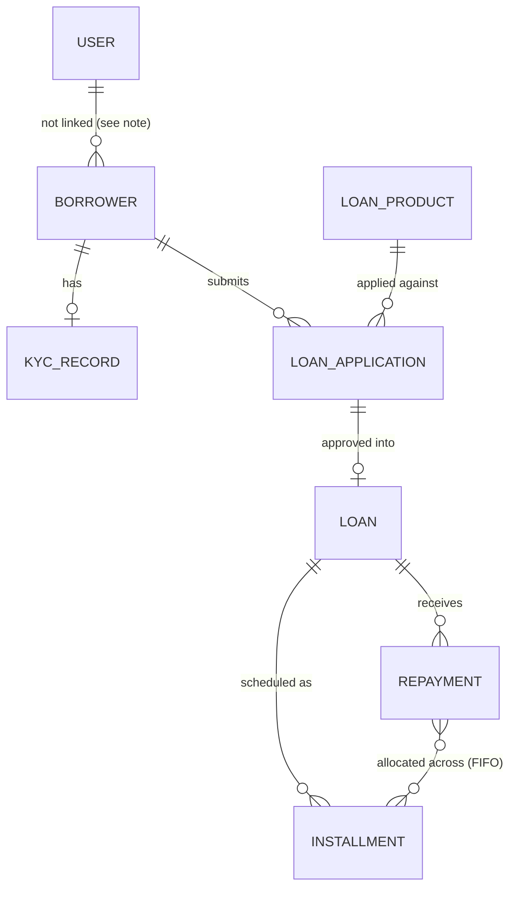
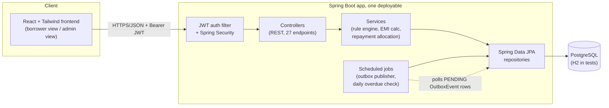

# Microloan Management Platform

A backend for running a small digital lending business, plus a minimal frontend that demos
the whole flow. Built as a personal project to go deep on things that are easy to wave hands
at in interviews: row-level locking under real concurrency, an immutable audit trail for
money terms, and reliable event publishing when the DB commit and the "notify someone" step
can't be the same operation.

## What a microloan is

A microloan is a small, short-tenure loan, usually a few thousand to a few lakh rupees, paid
back over a handful of months in fixed EMIs (equated monthly installments). Compared to a
regular bank loan, the amounts are smaller and the underwriting is lighter: instead of a
formal credit bureau check, a lender defines simple eligibility rules (income, requested
amount, tenure, how much KYC the borrower has completed) and approves or rejects against
those.

## What this project does

It's a working model of that lending business end to end:

- A borrower creates a profile, completes a KYC step (an OTP challenge that raises their KYC
  level from `NONE` to `BASIC`), and applies for a loan against a product an admin has listed.
- The application is checked automatically against that product's eligibility rules. If it
  passes, an admin approves it; approval freezes the loan's terms and generates a repayment
  schedule.
- The borrower acknowledges the agreement, which disburses the loan and activates the
  installment schedule.
- The borrower makes repayments against outstanding installments, oldest first, until the
  loan is fully paid off and closes.
- A daily job walks active loans, marks anything past its due date as overdue, and applies a
  penalty. State changes that matter (approved, repaid, overdue) are recorded as events so
  another system could react to them without being called synchronously.

## Domain model



- **User**: login identity only (username, password hash, role: `BORROWER` or `ADMIN`). Not
  connected to a `Borrower` record. See the note below, this is deliberate.
- **Borrower**: the actual loan-domain profile (name, phone, email, income, KYC level).
- **KycRecord / OtpVerification**: an OTP challenge tied to a borrower, with attempt limits and
  an expiry. Verifying it raises the borrower's `KycLevel` (`NONE` → `BASIC` → `FULL`).
- **LoanProduct**: what an admin offers, principal range, tenure range, interest rate, penalty
  rate, and the minimum KYC level required to apply.
- **LoanApplication**: a borrower's request against a product (`PENDING` → `APPROVED` /
  `REJECTED`).
- **Loan**: created the moment an application is approved, starts in `AGREEMENT_PENDING`, moves
  to `ACTIVE` once acknowledged, `OVERDUE` if a due installment is missed, `CLOSED` once fully
  paid. Carries a frozen JSON `agreementSnapshot` of the terms at approval time.
- **Installment**: one EMI in the schedule, with a due date, amount, and status.
- **Repayment**: one payment attempt, identified by a unique `paymentReference`, allocated
  across unpaid installments oldest first.
- **OutboxEvent**: a row written in the same transaction as a state change worth notifying
  about (`LOAN_APPROVED`, `REPAYMENT_RECEIVED`, `LOAN_OVERDUE`), published later by a
  scheduled job.

One deliberate gap worth knowing about: `User` (login/auth) and `Borrower` (the loan-domain
profile) are not linked to each other. Registering as a `BORROWER` just proves you can log in;
you separately create or look up a `Borrower` by ID to actually apply for a loan. The
frontend's "enter your Borrower ID / create one" step reflects this honestly instead of
papering over it.

## Architecture



The frontend and backend deploy as two separate pieces (a static site and a web service), not
bundled into one image. CORS is enabled on the backend specifically for this. See
[`DEPLOYMENT.md`](DEPLOYMENT.md) for how that maps onto Render.

## Tech stack

- **Backend:** Java 17, Spring Boot 4.1, Spring Data JPA / Hibernate, Spring Security (JWT), Flyway
- **DB:** PostgreSQL in production/dev, H2 (Postgres-compatibility mode) in tests
- **Testing:** JUnit 5, Mockito, AssertJ, `@WebMvcTest`/MockMvc for controller slices, one true
  `@SpringBootTest` + `@AutoConfigureMockMvc` end-to-end test for the full lifecycle
- **Frontend:** React (Vite), Tailwind CSS v4, no router, no state library, plain `fetch`
- **Containerization/Deploy:** Docker (multi-stage build), Docker Compose for local dev, Render
  for the live deployment

## Engineering patterns

Each of these is a deliberate choice, not the only way to build this. See the linked file for
the reasoning in context.

1. **Pessimistic locking on repayment processing.** A repayment locks the `Loan` and its unpaid
   `Installment` rows (`SELECT ... FOR UPDATE`) before allocating funds FIFO, since retrying a
   failed money allocation is expensive and confusing, but a short lock wait isn't.
   → `service/RepaymentService.java`
2. **Optimistic locking on application/loan state transitions.** `@Version` on `LoanApplication`
   and `Loan`, in contrast with #1: used where conflicts are rare and a retry is cheap.
   → `entity/LoanApplication.java`, `entity/Loan.java`
3. **Immutable agreement snapshot.** Approving a loan freezes its terms (principal, rate,
   tenure, computed EMI) into a JSON snapshot, so a later `LoanProduct` rate change never
   silently changes an existing loan's terms.
   → `service/LoanApplicationService.java` (`buildLoan`), `dto/loan/AgreementSnapshot.java`
4. **Idempotent repayment and penalty processing.** `paymentReference` has a unique constraint
   and doubles as an idempotency key. `Installment.penaltyApplied` stops a re-run overdue job
   from charging a penalty twice.
   → `service/RepaymentService.java`, `service/OverdueService.java`
5. **Configurable rule engine.** Loan eligibility (principal range, tenure range, minimum KYC
   level, EMI-to-income ratio) is a list of `EligibilityRule` beans, not hardcoded if/else.
   → `service/eligibility/`
6. **Transactional outbox pattern.** State changes that need to notify (approved, repaid,
   overdue) write an `OutboxEvent` row in the same transaction as the state change. A separate
   scheduled poller publishes it, so nothing is lost on a crash between the two.
   → `service/OutboxEventWriter.java`, `service/OutboxPublisher.java`
7. **Scheduled batch job.** A daily job pages through active loans, marks overdue installments,
   and applies penalties idempotently.
   → `service/OverdueService.java`

## API reference

All routes are prefixed at the application root (no `/api` prefix). Endpoints marked ADMIN
require an authenticated `ADMIN` user; everything else just requires any authenticated user.
`/auth/register` and `/auth/login` are public.

### Auth

| Method | Path | What it does |
|---|---|---|
| POST | `/auth/register` | Create a login (username, password, role) |
| POST | `/auth/login` | Exchange credentials for a JWT |
| GET | `/auth/me` | Return the current user's identity from their token |

### Borrowers

| Method | Path | What it does |
|---|---|---|
| POST | `/borrowers` | Create a borrower profile |
| GET | `/borrowers/{id}` | Fetch one borrower |
| PUT | `/borrowers/{id}` | Update a borrower's details |
| GET | `/borrowers` | List borrowers, paginated |

### KYC

| Method | Path | What it does |
|---|---|---|
| POST | `/borrowers/{borrowerId}/kyc/initiate` | Start an OTP challenge for a borrower |
| POST | `/borrowers/{borrowerId}/kyc/verify-otp` | Verify the OTP and raise the borrower's KYC level |
| GET | `/borrowers/{borrowerId}/kyc` | Get a borrower's current KYC status |

### Loan products

| Method | Path | What it does |
|---|---|---|
| POST | `/loan-products` | Create a loan product (ADMIN) |
| GET | `/loan-products/{id}` | Fetch one loan product |
| PUT | `/loan-products/{id}` | Update a loan product (ADMIN) |
| GET | `/loan-products` | List loan products, paginated |

### Loan applications

| Method | Path | What it does |
|---|---|---|
| POST | `/loan-applications` | Submit an application, runs the eligibility rules |
| GET | `/loan-applications/{id}` | Fetch one application |
| GET | `/loan-applications` | List applications, paginated |
| POST | `/loan-applications/{id}/approve` | Approve an application and create the loan (ADMIN) |
| POST | `/loan-applications/{id}/reject` | Reject an application with a reason (ADMIN) |

### Loans

| Method | Path | What it does |
|---|---|---|
| GET | `/loans` | List loans, paginated |
| GET | `/loans/{id}` | Fetch one loan |
| GET | `/loans/{id}/installments` | Get a loan's full installment schedule |
| POST | `/loans/{id}/agreement/acknowledge` | Acknowledge the agreement, disburses the loan |

### Repayments

| Method | Path | What it does |
|---|---|---|
| POST | `/repayments` | Process a repayment against a loan |
| GET | `/repayments/{id}` | Fetch one repayment |
| GET | `/loans/{id}/repayments` | List repayments made against a loan |

### Admin

| Method | Path | What it does |
|---|---|---|
| POST | `/admin/run-overdue-check` | Manually trigger the overdue/penalty batch job |
| GET | `/admin/outbox` | List outbox events, optionally filtered by status |

## Project layout

```
src/main/java/.../
  entity/        JPA entities
  repository/     Spring Data repositories
  service/        business logic (incl. eligibility/ rule engine)
  controller/     REST controllers
  dto/            request/response records
  security/       JWT filter, Spring Security config
  exception/      global exception handling
src/main/resources/db/migration/   Flyway migrations (V1-V7)
src/test/java/...                  unit tests, controller slices, one full-lifecycle e2e test
frontend/                          React + Tailwind UI (separate npm project)
Dockerfile, docker-compose.yml     backend containerization
render.yaml, DEPLOYMENT.md         deployment
DEMO.pdf                           demo walkthrough with screenshots
```

## Deployment & demo

- [`DEPLOYMENT.md`](DEPLOYMENT.md), deploying to Render (recommended) or Railway
- [`DEMO.pdf`](DEMO.pdf), a walkthrough of the full lifecycle with screenshots
